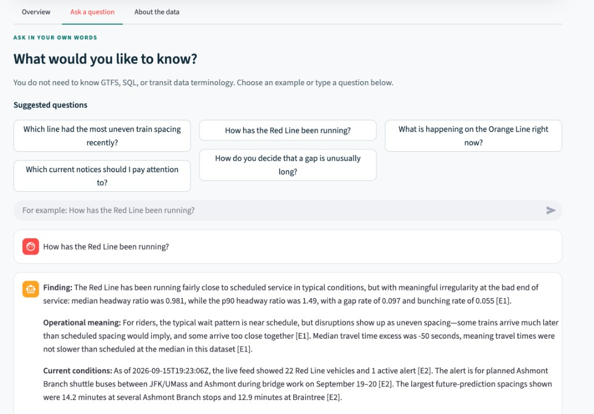
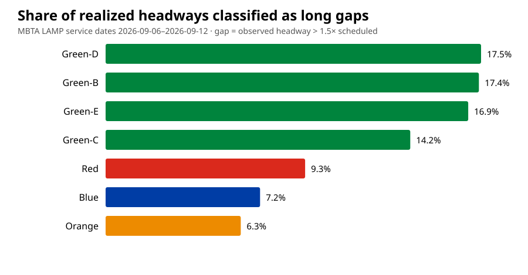

# T-Analyst: An Auditable Agent for MBTA Transit Operations

**Position/Track: Agentic AI**

T-Analyst is an interactive transit-analysis tool for users who have questions
about subway service but do not know how to work directly with GTFS, MBTA APIs,
or historical operations datasets.

The app combines a live MBTA network view with a natural-language analysis
interface. Its main design goal is auditability: each answer can be traced to
the tool call, parameters, data source, timestamp, and evidence used to produce
it.

## Why this is useful

Transit data is public, but it is not always easy to use. A question such as
“Which line had the most uneven train spacing recently?” can require finding
the correct dataset, understanding service dates, matching observed and
scheduled headways, and handling missing values.

A natural-language interface can lower that barrier, but only if the resulting
answers can be checked.

For that reason, T-Analyst does not ask the language model to calculate transit
metrics or generate arbitrary SQL. The model has a narrower role: understand
the user's question, select from a small set of read-only analysis tools, and
explain the evidence returned by those tools. Metric calculations remain in
deterministic Python code.

I limited the prototype to MBTA subway service. Historical analysis uses the
latest seven complete MBTA LAMP service days, while live analysis uses a current
MBTA V3 API snapshot. This scope was large enough to demonstrate an agentic
workflow while remaining appropriate for a short technical evaluation.

## Artifact

The Streamlit app has three main views:

1. **Overview** maps vehicles that are currently reporting a position, shows
   service notices, and compares recently realized train spacing by route.
2. **Ask a question** accepts everyday language and returns an answer with an
   optional “how this answer was made” panel.
3. **About the data** explains the workflow, metric definitions, and limits of
   the analysis.

Questions the artifact is designed to answer include:

- Which line had the most uneven train spacing recently?
- How has the Red Line been running?
- What is happening on the Orange Line right now?
- How does the app decide that a gap is unusually long?



## Method

For historical analysis, I calculate the following metrics from MBTA LAMP data:

- `headway ratio = observed headway / scheduled headway`
- `gap = headway ratio > 1.5`
- `bunched = headway ratio < 0.5`
- `travel-time excess = observed travel time - scheduled travel time`

A **headway** is the time spacing between consecutive trains in the same service
context. A realized headway describes observed train spacing; it is not the same
as an individual passenger's wait time.

A **live prediction gap** is the interval between consecutive future predictions
for one route, stop, and direction. I keep prediction gaps separate from
historical realized headways because predictions can change and are not proof
of actual observed train spacing.

### Station resolution

LAMP exports use canonical MBTA place IDs in fields such as `parent_station`
rather than rider-facing names.

Before a station query runs, T-Analyst:

1. normalizes case, punctuation, and spacing;
2. maps common aliases such as Harvard Square, Kendall, Kendall Square, MIT,
   State Street, and State Station to canonical MBTA place IDs;
3. uses the current MBTA V3 station index for other subway stations;
4. applies conservative fuzzy matching only when no exact match is available;
5. records the requested name, canonical name, place ID, and resolution method
   in the returned evidence.

### Agent workflow

When a user submits a question, Parley GPT-5.5 first produces a small JSON plan
containing one to three tool calls.

Pydantic validates the tool names, arguments, route names, and required fields
before execution. The selected read-only Python tools then return structured
evidence with IDs such as `[E1]`.

GPT-5.5 generates the final explanation only from that evidence. If the answer
does not cite evidence produced in the same run, T-Analyst falls back to a
deterministic summary rather than displaying an unsupported response.

## Key findings

The reproducible snapshot for September 6–12, 2026 contains 298,851 trip-stop
rows. In this window, the Green Line branches had the highest shares of
headways longer than 1.5 times their matched schedules. Green-D was highest at
17.5% across 38,840 usable headway observations. Green-B was close behind at
17.4%, followed by Green-E at 16.9% and Green-C at 14.2%. Red, Blue, and Orange
were lower at 9.3%, 7.2%, and 6.3%, respectively.



I would treat this as a lead for further analysis, not evidence that Green-D is
chronically the least reliable route. The Green Line branches share downtown
infrastructure, and this comparison does not control for weekday versus weekend
service, incidents, construction, or demand. My next step would be to separate
the results by day type and time of day, then compare branch headways with
headways on the shared trunk.

## Run locally

The submitted version was tested with Python 3.9.

```bash
python3 -m venv .venv
source .venv/bin/activate
pip install -r requirements.txt
cp .env.example .env
# Open .env and add the Parley key. .env is ignored by Git.
python check_parley.py
python prepare_data.py
streamlit run app.py
```

The app uses `https://parley.api.mit.edu/v1` and confirms `gpt-5.5` through the
API's `/v1/models` endpoint. An MBTA key is optional; anonymous requests are
enough for this prototype. Without a Parley key, the data views still work and
questions receive a simpler deterministic response.

Run tests with:

```bash
pytest -q
```

## Agent evaluation

T-Analyst includes a fixed 20-question regression suite covering:

- historical network and line reliability;
- live service status;
- station-level realized headways;
- metric definitions;
- station aliases and entity resolution;
- multi-tool comparison.

On the current 20-question GPT-5.5 evaluation:

- correct tool selection: **20/20**
- usable tool results: **20/20**
- valid final citations: **20/20**
- end-to-end pass: **20/20**

The suite includes rider-facing station names such as Harvard Square, Kendall
Square, MIT, State Street, and Park Street, as well as questions that require
combining live and historical evidence.

This is a small development evaluation rather than a held-out benchmark. Its
purpose is to provide a repeatable regression check for tool selection,
evidence quality, entity resolution, and grounding.

See the full evaluation report:
[evaluation report](evaluation/results-gpt-5.5.md)

## Data and resources

- [MBTA V3 API](https://www.mbta.com/developers/v3-api): live vehicles,
  predictions, and service alerts.
- [MBTA LAMP Public Data](https://performancedata.mbta.com/): daily subway
  performance Parquet files.
- [LAMP Data Dictionary](https://github.com/mbta/lamp/blob/main/Data_Dictionary.md):
  field definitions and calculated metrics.
- [MBTA GTFS documentation](https://github.com/mbta/gtfs-documentation):
  schedule and GTFS-Realtime implementation details.
- [MassDOT Developers License Agreement](https://www.mbta.com/developers):
  terms governing MBTA data use.
- Streamlit, pandas, Plotly, requests, OpenAI's Python client, and Pydantic are
  used under their respective open-source licenses.

I reviewed the task's references to TransitGPT and the Jarvus GTFS-RT Sandbox
while deciding on scope, but did not copy code from either project.

## Compute

- Platform: MIT Parley API through its OpenAI-compatible endpoint
- Model: `gpt-5.5`
- Access tier: MIT individual complimentary API credits ($30 per month)
- Local compute: Apple M4, 10 CPU cores, 16 GB memory

## Limitations

- Seven recent complete service days are insufficient for trend inference.
- The analysis does not control for incidents, construction, demand, or
  schedule changes.
- Missing or unmatched GTFS/GTFS-RT observations are excluded from the relevant
  metric.
- Real-time feeds are snapshots and may update immediately after display.
- Prediction gaps are not realized headways or guaranteed passenger waits.
- The tool registry supports a deliberately bounded set of question types.

Hours spent: 7
