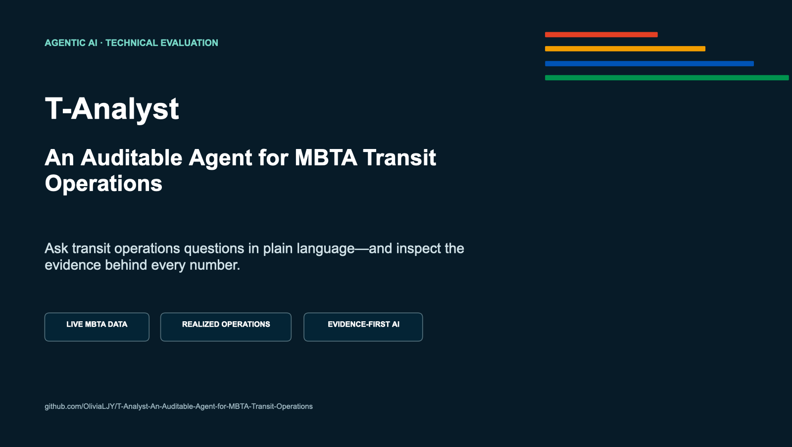

# Project Presentation

[Download the PowerPoint deck](T-Analyst-Presentation.pptx)

The deck contains 10 slides for a 6–8 minute introduction to T-Analyst:

1. Project framing
2. The problem
3. Product experience
4. Data sources
5. Agent architecture
6. Audit trail
7. Example finding
8. Competitive strengths
9. Limits and next steps
10. Closing and live-demo prompt

Detailed narration is available in
[PRESENTATION_NOTES.md](PRESENTATION_NOTES.md).



To regenerate the deck:

```bash
pip install -r presentation/requirements.txt
python presentation/create_presentation.py
```
